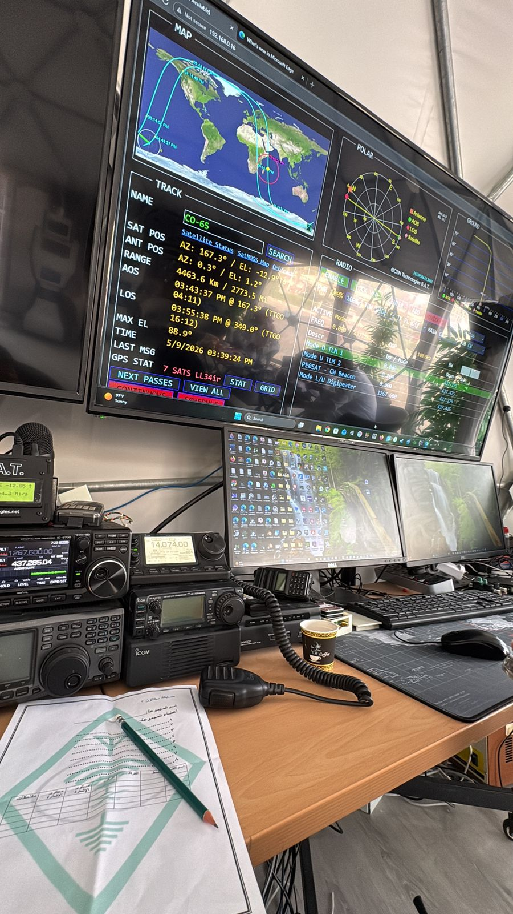
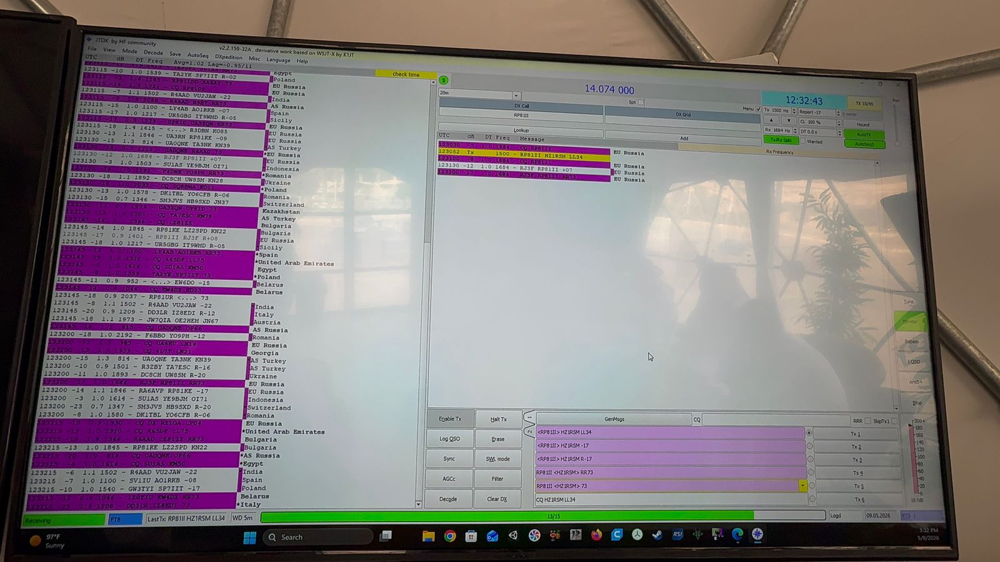
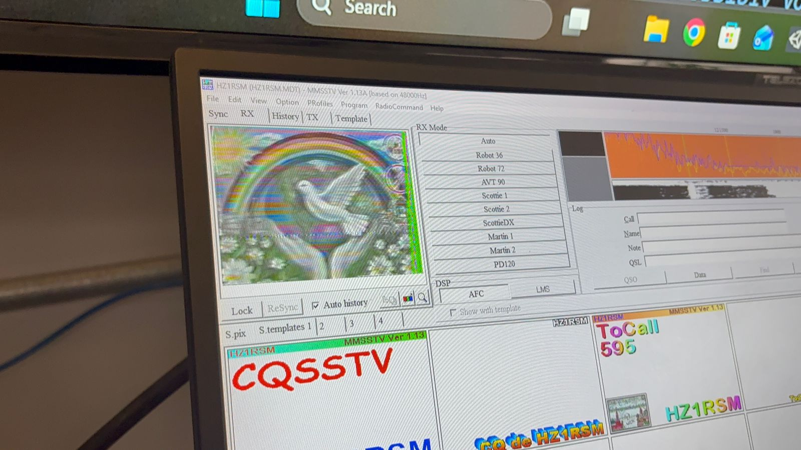
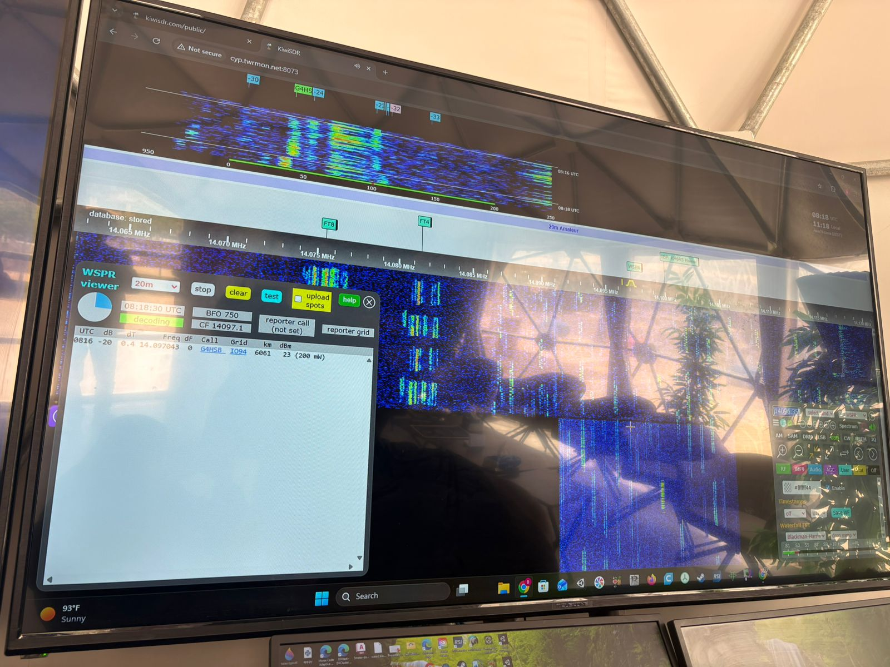
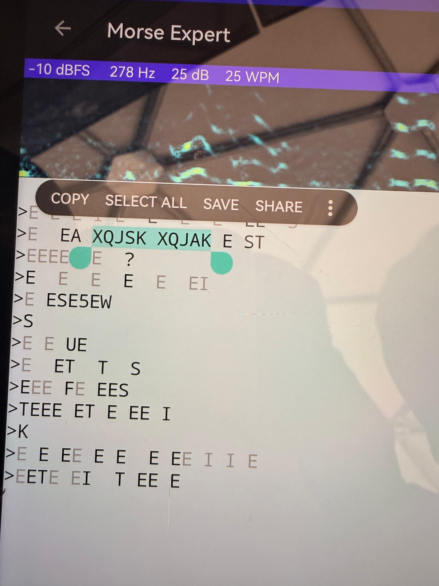
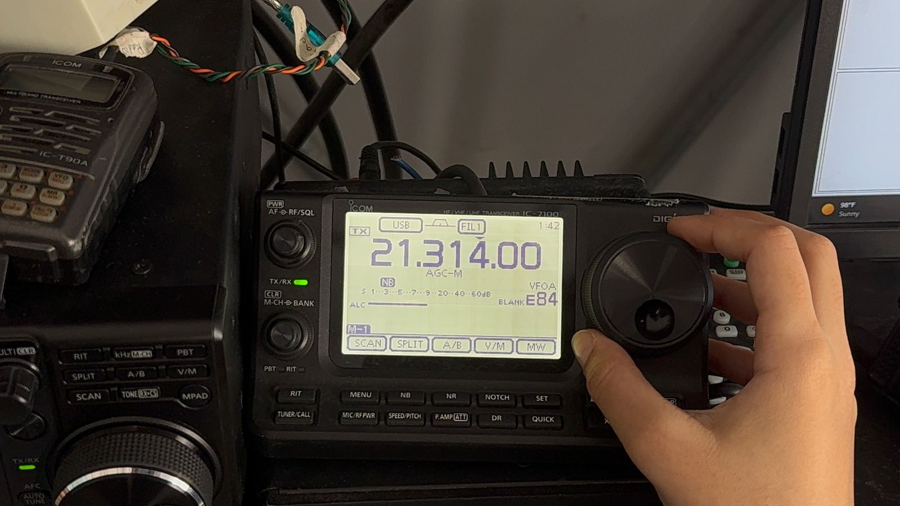
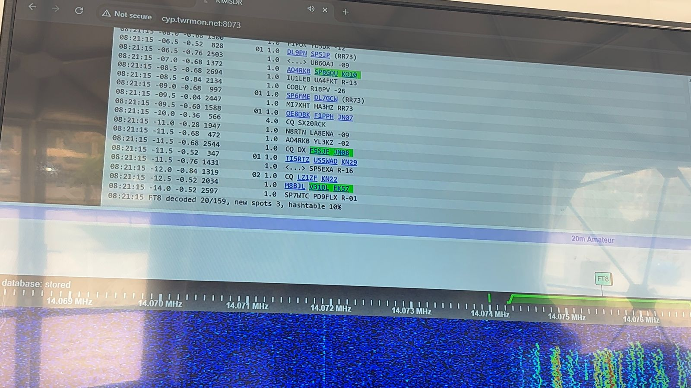

# Satathon - Team Digital Apollo

Hands-on satellite and HF radio signal reception at the Satathon 2026 competition: tracking amateur satellites, receiving and decoding live signals (CW/Morse, FT8, WSPR, SSTV, voice), and logging each contact.

[English](#english) · [العربية](#arabic) · [▶ Demo video](https://youtu.be/BvtABBpzqYA)

---

## Overview

Satathon is a satellite / radio communications challenge. As team **Digital Apollo**, we worked at a ground station equipped with ICOM transceivers, a satellite-tracking display, and decoding software. The goal was to find, receive, and identify as many signals as possible, then record them in a structured log.

## What We Did

- **Satellite tracking**: followed amateur satellites (e.g. CO-65) on a live tracking display showing azimuth/elevation, range, AOS/LOS times, and the ground track.
- **Manual tuning**: tuned ICOM HF/VHF/UHF transceivers (IC-7100 and others) by hand to find signals.
- **CW / Morse decoding**: decoded Morse signals with the *Morse Expert* app.
- **FT8 digital mode**: monitored FT8 traffic on 20 m (14.074 MHz) with **JTDX** and an online **KiwiSDR** receiver.
- **WSPR**: used KiwiSDR's WSPR viewer to decode weak-signal propagation reports.
- **SSTV image reception**: received slow-scan television images with **MMSSTV**.
- **Voice / SSB**: listened for voice contacts and recorded the call signs.
- **Signal log**: logged each signal with satellite/band, mode, frequency, time, signal level, decoded content, and notes.

## Signal Log (excerpt)

Taken from the team's competition sheet ([`data/signal-log.xlsx`](data/signal-log.xlsx)). Frequencies are shown as written in the log.

| Source | Mode | Frequency | Time | Level | Decoded content | Notes |
|---|---|---|---|---|---|---|
| CO-65 | CW | 14.014.00 | 03:43 | 5 | - | Could not decode |
| HF | FT8 | 14.047.00 | 03:32 | 7 | RJ3F | Received at −17 |
| AO-07 | CW | 14.024.00 | 03:56 | 5 | XQJSK | |
| AO-73 | CW | 14.008.00 | 03:56 | 3 | - | Could not decode |
| - | Voice | 21.260.00 | 04:52 | 9 | YB5DDE | Call sign |
| - | Voice | 14.270.00 | 05:38 | 9 | IK4GNI | Call sign |

The sheet also records an antenna check (SWR test).

## Tools & Equipment

| Category | Used |
|---|---|
| Radios | ICOM transceivers (IC-7100, IC-T90A handheld, and others at the station) |
| Tracking | Satellite-tracking display (map, polar plot, AOS/LOS) |
| Digital modes | JTDX (FT8), KiwiSDR web SDR (FT8, WSPR) |
| Image | MMSSTV (SSTV) |
| CW | Morse Expert (mobile app) |
| Logging | Excel |

## Screenshots

| | |
|---|---|
|  |  |
| JTDX: FT8 decodes on 20 m | MMSSTV: received SSTV image |
|  |  |
| KiwiSDR: WSPR viewer | Morse Expert: CW decode (XQJSK) |
|  |  |
| Manual tuning on the IC-7100 | KiwiSDR: FT8 decode list |

More images: [`media/`](media/)

## Demo

The team's submission video, *Digital Apollo Sathon 2026 Submission*:

▶ **[Watch on YouTube](https://youtu.be/BvtABBpzqYA)** · [Google Drive (full quality)](https://drive.google.com/file/d/16Xb40qC_47T5XWn-I2eeNaP0EcNeGGmh/view)

## Team

**Digital Apollo**: Marwah Sabai · Dana Al-Anazi · Hailah Alhejjei

---

## نظرة عامة

مشاركة فريق **Digital Apollo** في مسابقة **ساتاثون 2026**، وهي تحدٍّ عملي في الاتصالات الراديوية والأقمار الصناعية. عملنا في محطة أرضية مجهّزة بأجهزة إرسال واستقبال ICOM وشاشة لتتبّع الأقمار وبرامج لفك الإشارات، وكان الهدف التقاط أكبر عدد من الإشارات والتعرّف عليها وتوثيقها في سجل منظّم.

## ماذا فعلنا

- **تتبّع الأقمار الصناعية** مثل CO-65 (الاتجاه والارتفاع، المدى، أوقات الظهور والغياب، والمسار).
- **الضبط اليدوي للتردد** على أجهزة ICOM مثل IC-7100.
- **فك شفرة مورس (CW)** باستخدام تطبيق Morse Expert.
- **استقبال FT8** على نطاق 20 متر عبر JTDX وجهاز KiwiSDR عبر الإنترنت.
- **قراءة إشارات WSPR** عبر KiwiSDR.
- **استقبال صور SSTV** باستخدام MMSSTV.
- **الاستماع للاتصالات الصوتية** وتسجيل رموز النداء.
- **تسجيل كل إشارة**: المصدر، النمط، التردد، الوقت، مستوى الإشارة، المحتوى، والملاحظات، إضافةً إلى فحص الهوائي (SWR).

## الفريق

**Digital Apollo**: مروة سبعي · دانا العنزي · هيله الحجي

